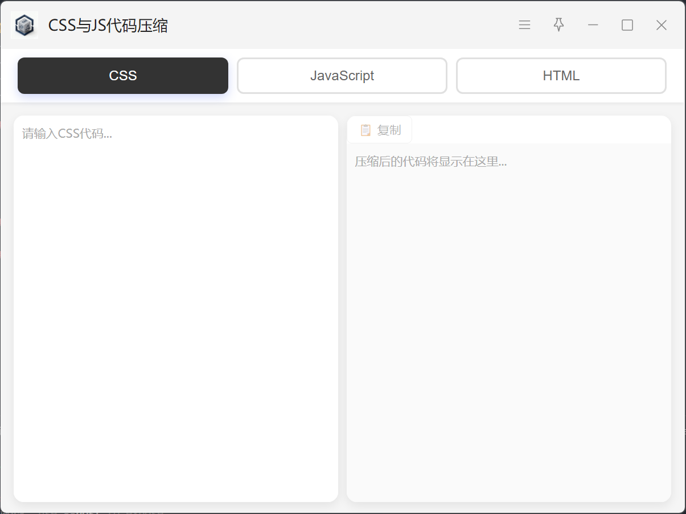

## CSS/JS/HTML 代码压缩插件

## 功能说明

这是一个用于压缩CSS、JavaScript和HTML代码的uTools插件，可以有效减少代码体积，去除不必要的空格、换行和注释。



## 功能特点

✨ **三种代码类型支持**
- CSS 压缩
- JavaScript 压缩  
- HTML 压缩

🎨 **简洁美观的界面**
- 顶部Tab切换不同代码类型
- 左右双输入框布局
- 实时压缩预览
- 压缩统计信息

⚡ **强大的压缩功能**
- 移除所有注释
- 去除多余空格和换行
- 优化代码格式
- 保持代码可执行性


## 压缩规则

### CSS压缩
- 移除注释 `/* ... */`
- 去除多余空格和换行
- 优化选择器和属性格式
- 压缩为单行代码

### JavaScript压缩
- 移除单行注释 `//`
- 移除多行注释 `/* ... */`
- 去除空格和换行
- 保留必要的空格（避免语法错误）
- 压缩为单行代码

### HTML压缩
- 移除HTML注释 `<!-- ... -->`
- 去除标签间的空白
- 优化属性格式
- 压缩为单行代码

## 开发调试

```bash
# 安装依赖
npm install

# 开发模式
npm run dev

# 构建
npm run build
```

## 注意事项

⚠️ **重要提示**
1. 压缩后的代码会移除所有注释和格式化
2. JavaScript压缩是基础压缩，不包含变量重命名等高级优化
3. 建议在生产环境使用前进行测试
4. 压缩不会混淆代码，变量名保持不变

## 技术栈

- Vue 3
- Vite
- uTools API

## 版本历史

### v1.0.0
- 初始版本
- 支持CSS/JS/HTML三种代码类型压缩
- 实时压缩预览
- 压缩统计信息
